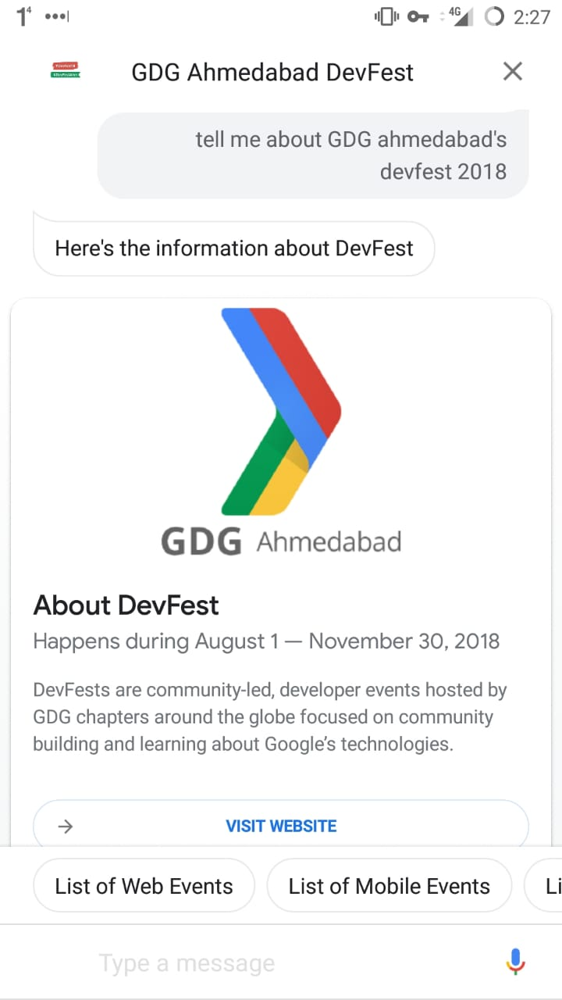
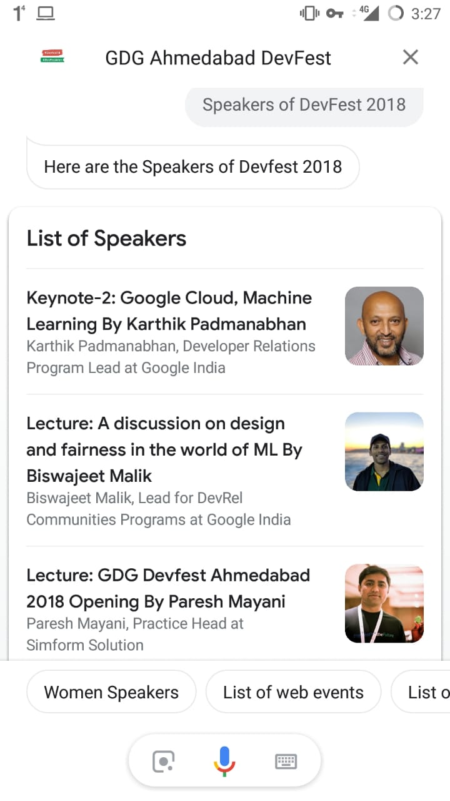
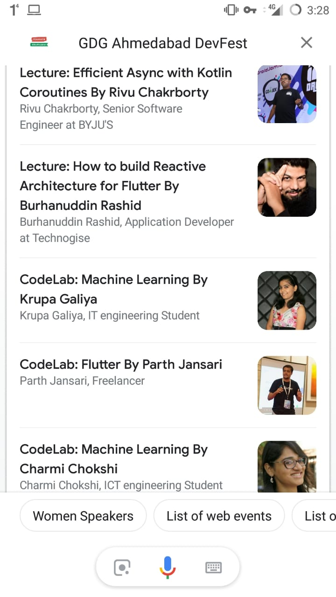
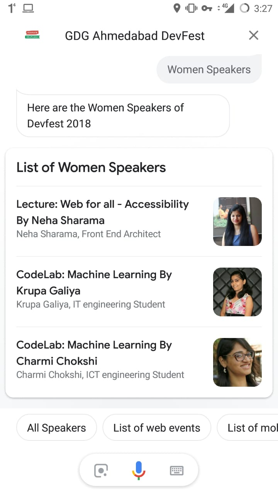
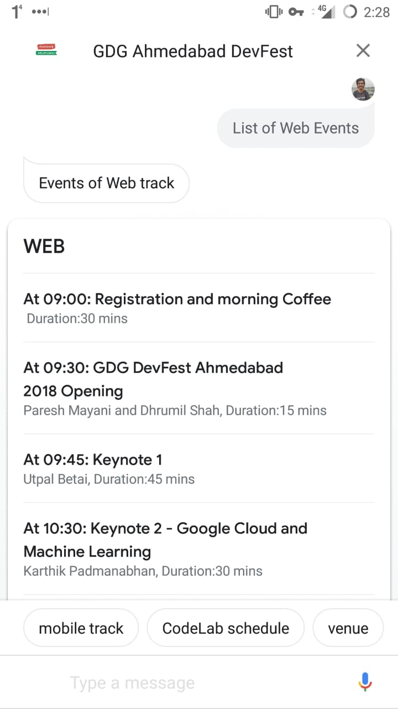
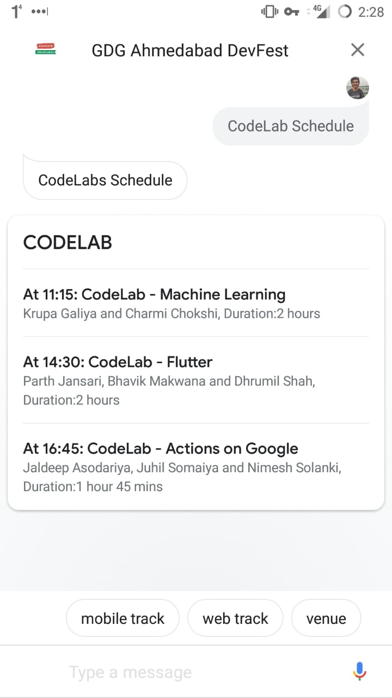
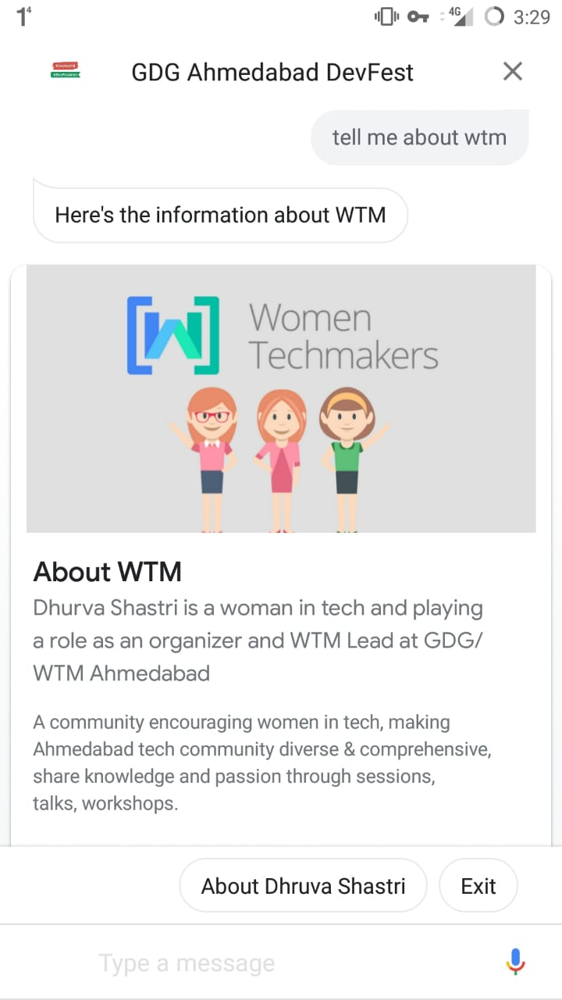

# GDG Ahmedabad DevFest Action

## Action Link: https://assistant.google.com/services/a/uid/000000865b9d1f60?hl=en-IN

This year GDG Ahmedabad's Devfest is on 25th Novemeber 2018
Venue: Courtyard Mariott

## 🤔 What it does?

It's a Google Assistant action that shows all the information about the DevFest events, speakers, Venue information and the details about all the committee members of GDG Ahmedabad.

## ASK YOUR ASSISTANT

Talk to GDG Ahmedabad DevFest

## SCREENSHOTS

### About GDG Ahmedabad

### List of Speakers

### Women Speakers in DevFest 2018

### Schedule of Web Track events

### Schedule of CodeLab

### Information About WTM Ahmedabad

## ❤️ Credits

- [Firebase Functions](https://firebase.google.com/products/functions)
- [DialogFlow](https://dialogflow.com/)

## 🎓 License

MIT
